<div align="center">

# 🛒 Go-Commerce

[](https://golang.org/)
[](https://nextjs.org/)
[](https://react.dev/)
[](https://www.mysql.com/)
[](https://tailwindcss.com/)
[](https://www.typescriptlang.org/)
[](LICENSE)

**Platform e-commerce full-stack modern yang dibangun dengan Go (backend) dan Next.js (frontend)**

*Aplikasi belanja online lengkap dengan manajemen produk, keranjang belanja, sistem pemesanan, voucher diskon, dashboard admin, serta fitur ulasan dan penilaian produk.*

[Fitur](#-fitur-utama) •
[Screenshot](#-tampilan-aplikasi) •
[Instalasi](#-instalasi--menjalankan-aplikasi) •
[Dependensi](#-dependensi) •
[Struktur Proyek](#-struktur-proyek) •
[API](#-api-endpoints)

</div>

---

## 📋 Daftar Isi

- [Tentang Proyek](#-tentang-proyek)
- [Fitur Utama](#-fitur-utama)
- [Tampilan Aplikasi](#-tampilan-aplikasi)
- [Teknologi yang Digunakan](#-teknologi-yang-digunakan)
- [Dependensi](#-dependensi)
- [Instalasi & Menjalankan Aplikasi](#-instalasi--menjalankan-aplikasi)
- [Struktur Proyek](#-struktur-proyek)
- [API Endpoints](#-api-endpoints)
- [Skema Database](#-skema-database)
- [Lisensi](#-lisensi)
- [Kontak](#-kontak)

---

## 🎯 Tentang Proyek

**Go-Commerce** adalah aplikasi e-commerce full-stack yang dirancang untuk memberikan pengalaman belanja online yang modern dan responsif. Proyek ini memadukan kekuatan **Go** sebagai backend yang cepat dan efisien dengan **Next.js 16** sebagai frontend yang modern dan interaktif.

Aplikasi ini mencakup seluruh alur belanja online — mulai dari menjelajahi produk, menambahkan ke keranjang, melakukan checkout, hingga pelacakan pesanan. Dilengkapi pula dengan sistem manajemen admin untuk mengelola produk, pesanan, dan pengguna, serta fitur voucher, ulasan produk, dan sistem keanggotaan.

### 🏗️ Arsitektur

```
┌─────────────────────────────────────────────────────────────┐
│                        Go-Commerce                          │
├──────────────────────┬──────────────────────────────────────┤
│   Frontend (Next.js) │         Backend (Go)                 │
│   Port: 3000         │         Port: 8080                   │
│                      │                                      │
│  ┌────────────────┐  │  ┌─────────────┐  ┌──────────────┐  │
│  │  React 19 +    │  │  │  Gorilla    │  │    MySQL     │  │
│  │  TypeScript    │◄─┼─►│  Mux Router │◄─┤   Database   │  │
│  │  Tailwind CSS  │  │  │  REST API   │  │              │  │
│  └────────────────┘  │  └─────────────┘  └──────────────┘  │
└──────────────────────┴──────────────────────────────────────┘
```

---

## ✨ Fitur Utama

### 👤 Autentikasi & Profil Pengguna
- Registrasi dan login pengguna dengan JWT (JSON Web Token)
- Manajemen profil: foto profil, informasi pribadi, alamat
- Sistem keanggotaan bertingkat (Bronze, Silver, Gold, Platinum)

### 🛍️ Katalog Produk
- Tampilan produk dengan galeri gambar
- Filter berdasarkan kategori, harga, dan rating
- Pencarian produk secara real-time
- Halaman detail produk dengan ulasan pelanggan

### 🛒 Keranjang Belanja & Checkout
- Tambah, ubah jumlah, dan hapus produk dari keranjang
- Aplikasi voucher diskon saat checkout
- Proses checkout 3 langkah: Pengiriman → Pembayaran → Konfirmasi

### 📦 Manajemen Pesanan
- Riwayat pesanan dengan filter status (Menunggu Pembayaran, Dikirim, Selesai, Dibatalkan)
- Detail pesanan lengkap
- Sistem ulasan dan penilaian produk setelah pesanan selesai

### 🎟️ Voucher & Diskon
- Daftar voucher yang tersedia untuk pengguna
- Filter voucher berdasarkan tipe dan status

### 📊 Dashboard
- **Dashboard Customer**: statistik pembelian, grafik pengeluaran, pesanan terbaru, voucher aktif
- **Dashboard Admin**: manajemen produk, manajemen pengguna, laporan penjualan

---

## 📸 Tampilan Aplikasi

### 🏠 Landing Page

#### Hero Section
Halaman utama dengan banner yang menarik, menampilkan tagline dan tombol call-to-action untuk memulai belanja.

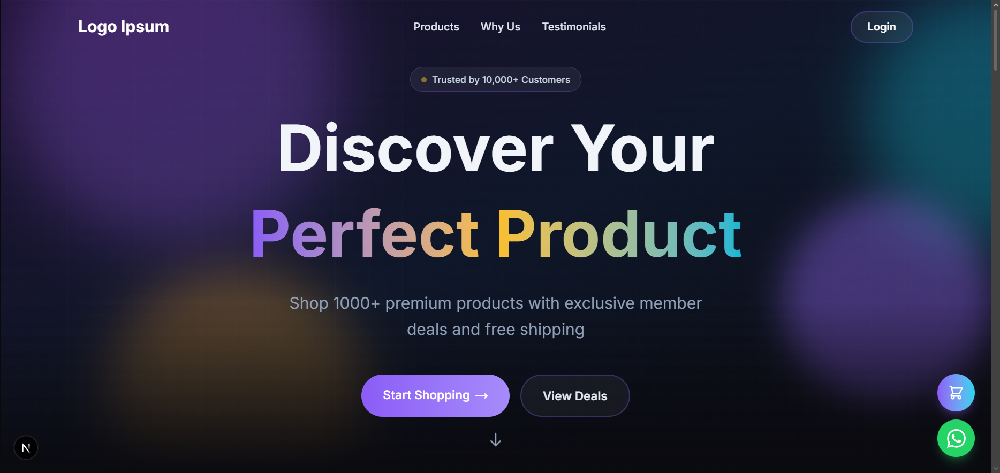

#### Bagian Produk Unggulan
Menampilkan produk-produk terpilih dan kategori populer langsung di halaman utama.

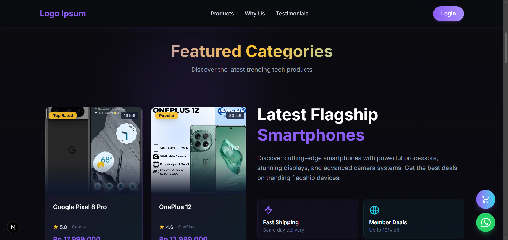

#### Kenapa Memilih Kami?
Bagian yang menjelaskan keunggulan dan nilai tambah platform kepada pengunjung baru.

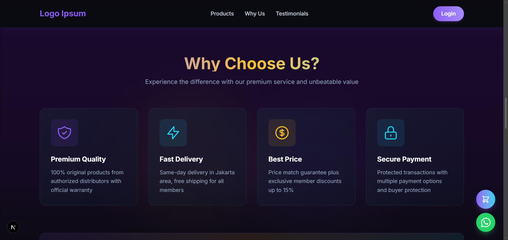

#### Testimoni Pelanggan
Ulasan dan pengalaman pelanggan yang telah menggunakan platform, membangun kepercayaan pengguna baru.

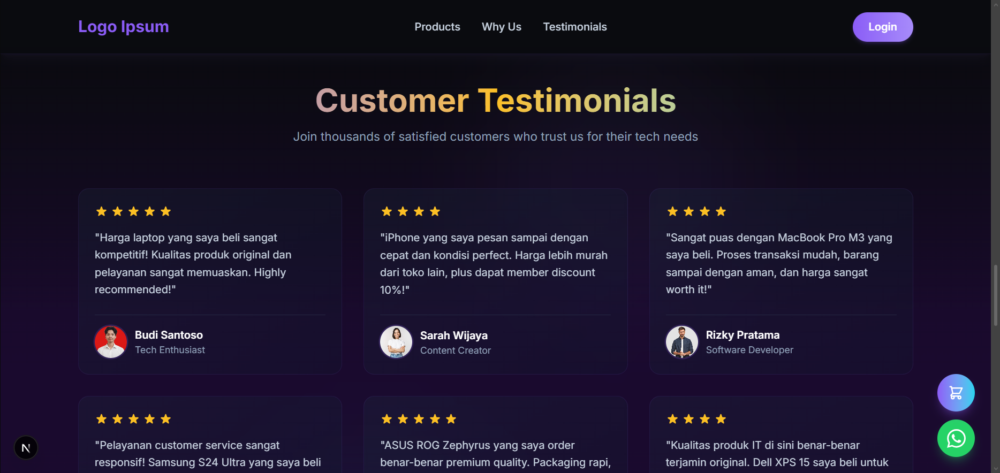

---

### 🔐 Autentikasi

#### Halaman Login
Form login yang bersih dengan validasi input dan notifikasi error yang informatif.

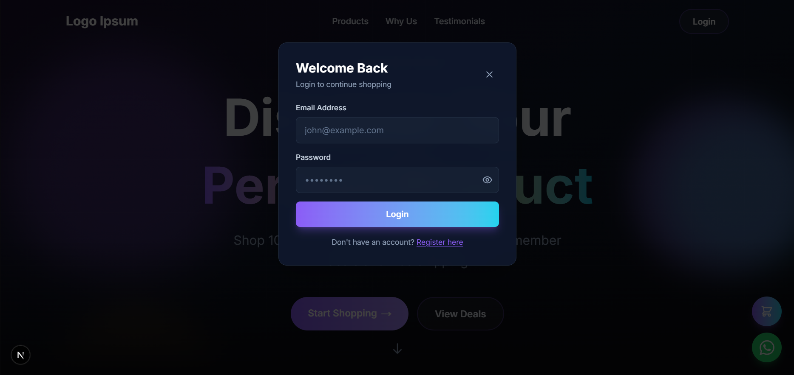

#### Halaman Registrasi
Form pendaftaran akun baru dengan validasi lengkap untuk memastikan data pengguna yang valid.

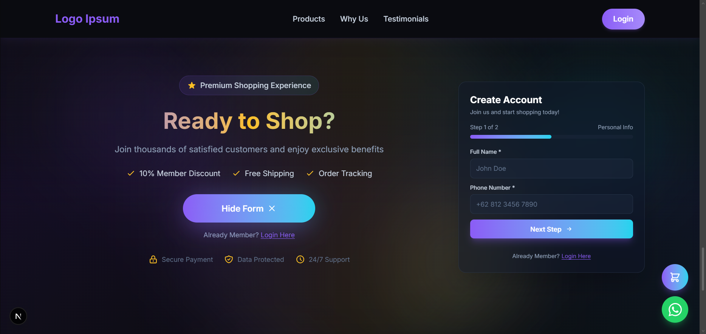

---

### 📦 Katalog & Detail Produk

#### Halaman Produk
Daftar seluruh produk dengan fitur filter kategori, rentang harga, rating, dan pencarian real-time. Dilengkapi pagination untuk navigasi yang nyaman.

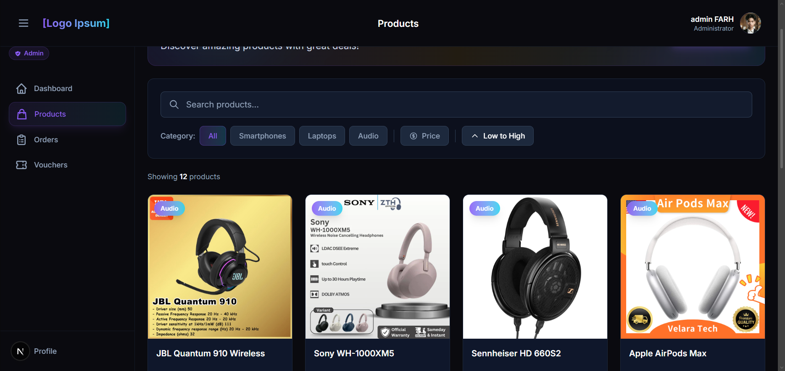

#### Detail Produk
Halaman detail produk yang lengkap dengan galeri gambar, deskripsi, spesifikasi, dan ulasan dari pelanggan lain.

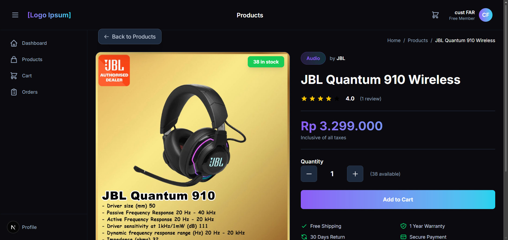

---

### 🛒 Keranjang & Checkout

#### Halaman Keranjang
Tampilan keranjang belanja dengan manajemen item — ubah jumlah, hapus produk, lihat total harga, dan terapkan voucher diskon.

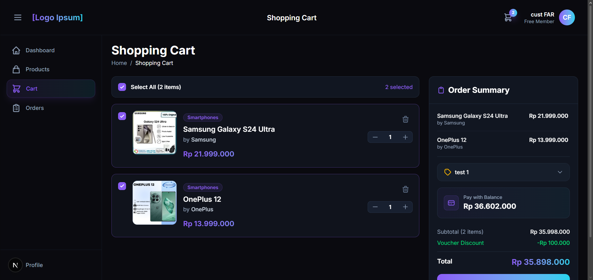

---

### 📋 Manajemen Pesanan

#### Halaman Riwayat Pesanan
Daftar seluruh pesanan pengguna yang dapat difilter berdasarkan status: Menunggu Pembayaran, Sedang Dikirim, Selesai, dan Dibatalkan.

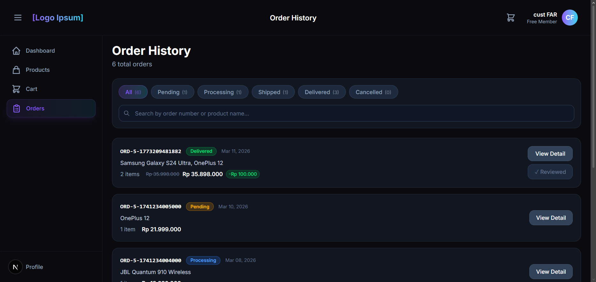

#### Detail Pesanan
Tampilan detail pesanan yang mencakup informasi produk, jumlah, harga, status pengiriman, dan ringkasan pembayaran.

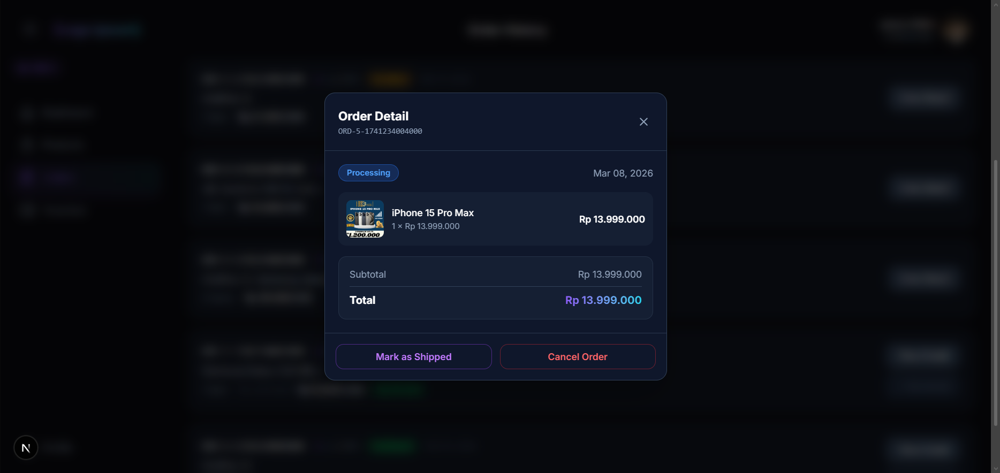

#### Modal Penilaian Produk
Setelah pesanan selesai, pengguna dapat memberikan ulasan dan rating bintang untuk setiap produk yang dibeli.

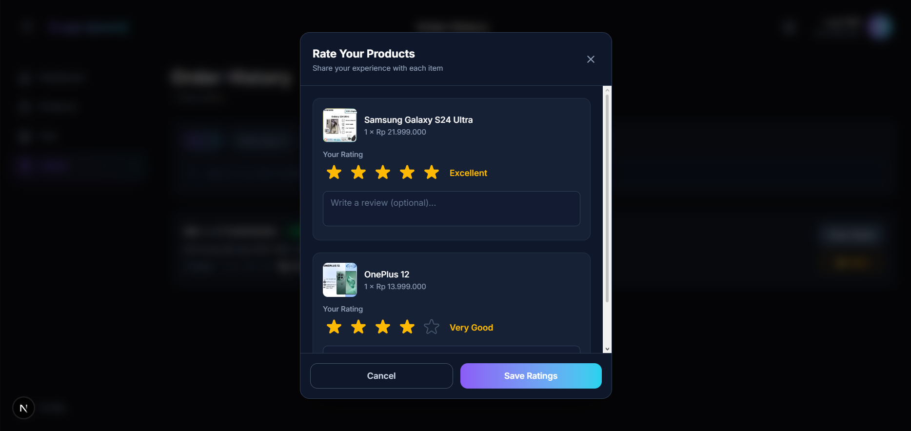

---

### 📊 Dashboard

#### Dashboard Customer — Ringkasan Akun
Halaman utama dashboard pelanggan dengan sambutan personal, status keanggotaan, dan ringkasan statistik belanja.

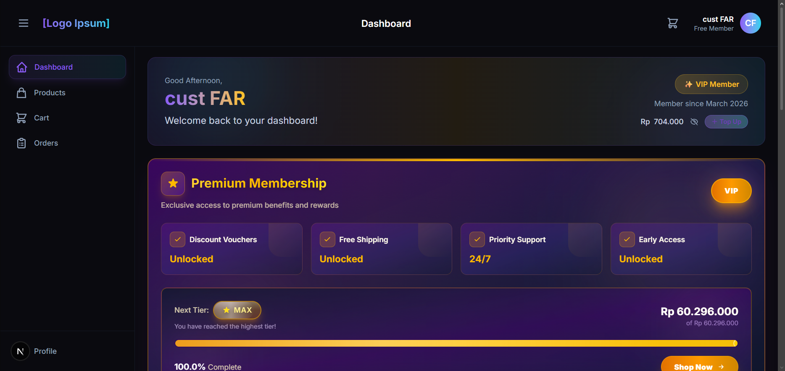

#### Dashboard Customer — Statistik & Grafik
Visualisasi data pengeluaran bulanan menggunakan grafik interaktif, membantu pelanggan memantau pola belanja mereka.

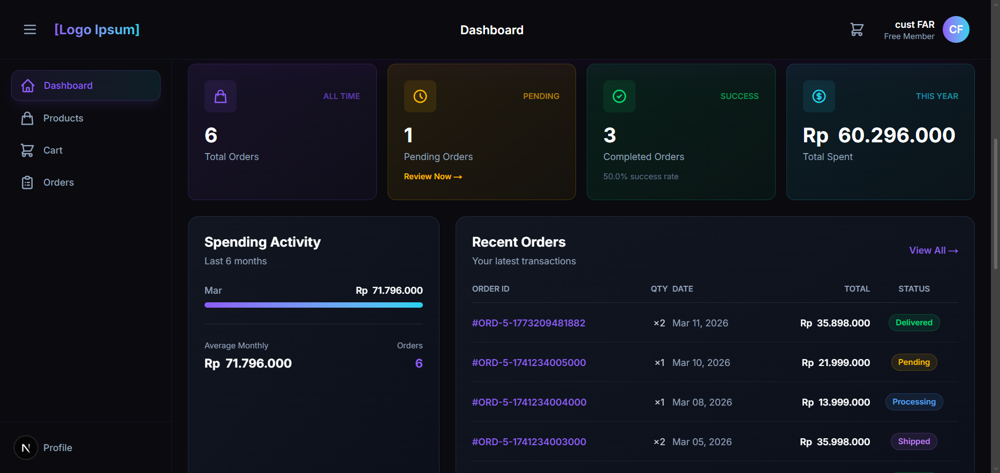

#### Dashboard Customer — Riwayat & Voucher
Tampilan pesanan terbaru beserta voucher aktif yang tersedia untuk digunakan pada transaksi berikutnya.

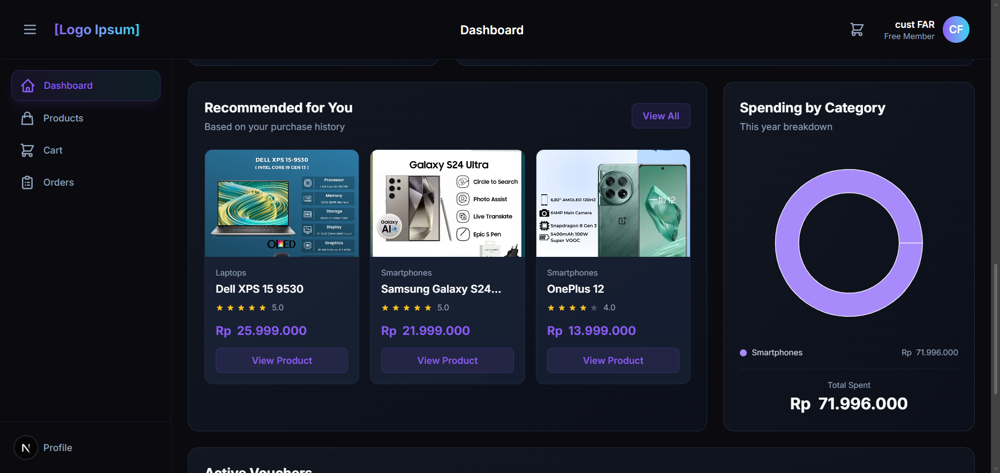

#### Dashboard Admin
Panel administrasi penuh untuk mengelola produk, memantau pesanan, dan melihat laporan penjualan secara keseluruhan.

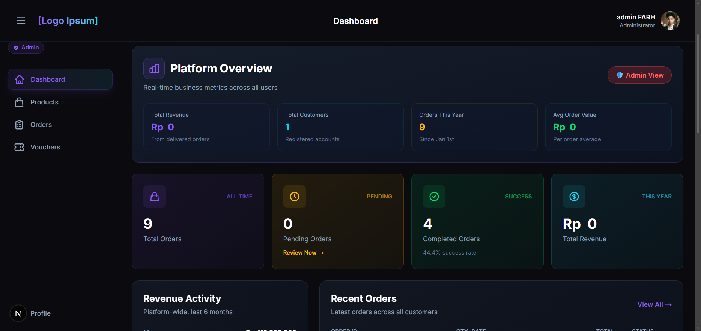

---

### 🎟️ Voucher & Profil

#### Halaman Voucher
Daftar voucher yang tersedia bagi pengguna dengan informasi diskon, syarat penggunaan, dan masa berlaku.

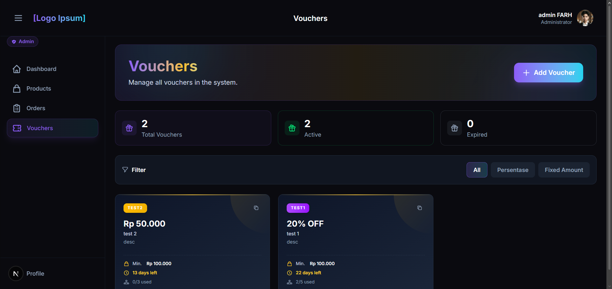

#### Pengaturan Profil
Halaman pengaturan akun untuk memperbarui informasi pribadi, foto profil, alamat pengiriman, dan kata sandi.

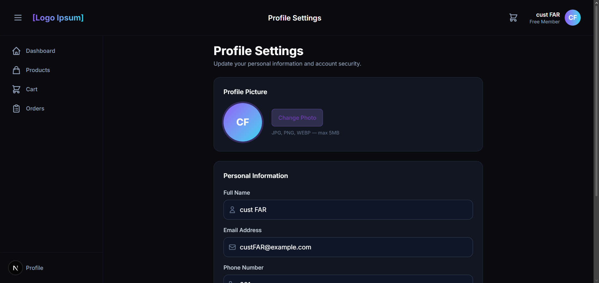

---

## 🛠️ Teknologi yang Digunakan

| Komponen | Teknologi |
|----------|-----------|
| **Frontend Framework** | Next.js 16 |
| **UI Library** | React 19 |
| **Bahasa (Frontend)** | TypeScript 5 |
| **Styling** | Tailwind CSS v4 |
| **Notifikasi** | React Hot Toast |
| **Grafik & Visualisasi** | Recharts |
| **Backend Language** | Go (Golang) 1.24 |
| **HTTP Router** | Gorilla Mux |
| **Autentikasi** | JWT (golang-jwt/jwt v5) |
| **Database** | MySQL 8.0 |
| **Database Driver** | go-sql-driver/mysql |
| **Enkripsi Password** | bcrypt (golang.org/x/crypto) |
| **Env Management** | godotenv |
| **Deployment (Frontend)** | Vercel |
| **Deployment (Backend)** | Railway |

---

## 📦 Dependensi

### Frontend (`package.json`)

#### Dependencies
| Paket | Versi | Deskripsi |
|-------|-------|-----------|
| `next` | 16.1.6 | Framework React untuk production |
| `react` | 19.2.3 | Library UI JavaScript |
| `react-dom` | 19.2.3 | Renderer DOM untuk React |
| `react-hot-toast` | ^2.6.0 | Notifikasi toast yang elegan |
| `recharts` | ^3.7.0 | Library grafik berbasis React |

#### Dev Dependencies
| Paket | Versi | Deskripsi |
|-------|-------|-----------|
| `typescript` | ^5 | Superset JavaScript dengan tipe statis |
| `tailwindcss` | ^4 | Framework CSS utility-first |
| `@tailwindcss/postcss` | ^4 | Plugin PostCSS untuk Tailwind CSS |
| `eslint` | ^9 | Linter JavaScript/TypeScript |
| `eslint-config-next` | 16.1.6 | Konfigurasi ESLint untuk Next.js |
| `@types/node` | ^20 | Tipe TypeScript untuk Node.js |
| `@types/react` | ^19 | Tipe TypeScript untuk React |
| `@types/react-dom` | ^19 | Tipe TypeScript untuk React DOM |
| `babel-plugin-react-compiler` | 1.0.0 | Plugin Babel untuk React Compiler |

### Backend (`go.mod`)

#### Direct Dependencies
| Modul | Versi | Deskripsi |
|-------|-------|-----------|
| `github.com/go-sql-driver/mysql` | v1.9.3 | Driver MySQL untuk database/sql |
| `github.com/gorilla/mux` | v1.8.1 | HTTP router dan dispatcher yang powerful |
| `golang.org/x/text` | v0.34.0 | Paket teks dan encoding untuk Go |

#### Indirect Dependencies
| Modul | Versi | Deskripsi |
|-------|-------|-----------|
| `filippo.io/edwards25519` | v1.1.0 | Implementasi kurva Edwards25519 |
| `github.com/golang-jwt/jwt/v5` | v5.3.1 | Implementasi JSON Web Token (JWT) |
| `github.com/joho/godotenv` | v1.5.1 | Membaca file `.env` untuk konfigurasi |
| `golang.org/x/crypto` | v0.48.0 | Algoritma kriptografi tambahan (bcrypt) |

---

## 🚀 Instalasi & Menjalankan Aplikasi

### Prasyarat

Pastikan perangkat Anda telah menginstal:
- [Go](https://golang.org/dl/) versi 1.24 atau lebih baru
- [Node.js](https://nodejs.org/) versi 18 atau lebih baru
- [MySQL](https://www.mysql.com/downloads/) versi 8.0 atau lebih baru
- [Git](https://git-scm.com/)

### Langkah 1: Clone Repository

```bash
git clone https://github.com/HHHAAAANNNNN/go-commerce.git
cd go-commerce
```

### Langkah 2: Setup Backend (Go)

```bash
# Masuk ke folder backend
cd backend

# Install dependensi Go
go mod download

# Buat file konfigurasi environment
cp .env.example .env
```

Edit file `.env` dengan konfigurasi database Anda:

```env
DB_HOST=localhost
DB_PORT=3306
DB_USER=root
DB_PASSWORD=your_password
DB_NAME=go_commerce
JWT_SECRET=your_secret_key
PORT=8080
```

### Langkah 3: Setup Database

```bash
# Login ke MySQL
mysql -u root -p

# Buat database
CREATE DATABASE go_commerce;

# Keluar dari MySQL
exit

# Jalankan skema database
mysql -u root -p go_commerce < schema.sql
```

### Langkah 4: Jalankan Backend

```bash
# Dari folder backend/
go run main.go
```

Server backend akan berjalan di `http://localhost:8080`

### Langkah 5: Setup Frontend (Next.js)

Buka terminal baru, dari root direktori proyek:

```bash
# Install dependensi Node.js
npm install

# Buat file konfigurasi environment
cp .env.local.example .env.local
```

Edit file `.env.local`:

```env
NEXT_PUBLIC_API_URL=http://localhost:8080
```

### Langkah 6: Jalankan Frontend

```bash
npm run dev
```

Aplikasi frontend akan berjalan di `http://localhost:3000`

### Langkah 7: Seed Data Admin (Opsional)

```bash
# Dari folder backend/
go run cmd/seedadmin/main.go
```

---

## 📁 Struktur Proyek

```
go-commerce/
├── 📁 app/                        # Frontend Next.js
│   ├── 📁 (app)/                  # Route group aplikasi utama
│   │   ├── 📁 cart/               # Halaman keranjang belanja
│   │   ├── 📁 checkout/           # Halaman checkout
│   │   ├── 📁 dashboard/          # Dashboard pengguna & admin
│   │   ├── 📁 orders/             # Halaman riwayat pesanan
│   │   ├── 📁 products/           # Katalog & detail produk
│   │   ├── 📁 profile/            # Pengaturan profil
│   │   ├── 📁 vouchers/           # Halaman voucher
│   │   └── 📄 layout.tsx          # Layout utama aplikasi
│   ├── 📁 components/             # Komponen React yang dapat digunakan ulang
│   │   ├── 📄 CartModal.tsx       # Modal keranjang belanja
│   │   ├── 📄 FloatingButtons.tsx # Tombol mengambang
│   │   ├── 📄 Footer.tsx          # Footer halaman
│   │   ├── 📄 LoginModal.tsx      # Modal login
│   │   ├── 📄 Navbar.tsx          # Navigasi bar
│   │   ├── 📄 RegisterModal.tsx   # Modal registrasi
│   │   ├── 📁 app/                # Komponen spesifik aplikasi
│   │   └── 📁 landing/            # Komponen landing page
│   ├── 📄 globals.css             # Style global
│   ├── 📄 layout.tsx              # Root layout
│   ├── 📄 page.tsx                # Landing page
│   └── 📁 utils/
│       └── 📄 api.ts              # Fungsi utilitas API
│
├── 📁 backend/                    # Backend Go
│   ├── 📁 cmd/                    # Command-line utilities
│   │   ├── 📁 checkorders/        # Melihat data pesanan
│   │   ├── 📁 checkusers/         # Melihat data pengguna
│   │   ├── 📁 droptables/         # Menghapus tabel database
│   │   └── 📁 seedadmin/          # Membuat akun admin
│   ├── 📁 config/
│   │   └── 📄 database.go         # Konfigurasi koneksi database
│   ├── 📁 controllers/            # Handler HTTP (MVC Controller)
│   │   ├── 📄 auth_controller.go  # Autentikasi (login, register)
│   │   ├── 📄 cart_controller.go  # Manajemen keranjang
│   │   ├── 📄 checkout_controller.go # Proses checkout
│   │   ├── 📄 product_controller.go  # Manajemen produk
│   │   ├── 📄 review_controller.go   # Ulasan & penilaian
│   │   ├── 📄 upload_controller.go   # Upload file/gambar
│   │   ├── 📄 user_controller.go     # Manajemen pengguna
│   │   └── 📄 voucher_controller.go  # Manajemen voucher
│   ├── 📁 middlewares/
│   │   ├── 📄 auth.go             # Middleware autentikasi JWT
│   │   └── 📄 middleware.go       # Logger & CORS middleware
│   ├── 📁 models/                 # Definisi struct database
│   │   ├── 📄 order.go            # Model pesanan
│   │   ├── 📄 product.go          # Model produk
│   │   └── 📄 user.go             # Model pengguna
│   ├── 📁 routes/
│   │   └── 📄 routes.go           # Definisi semua rute API
│   ├── 📁 utils/
│   │   ├── 📄 jwt.go              # Utilitas JWT
│   │   └── 📄 response.go         # Format respons API standar
│   ├── 📄 main.go                 # Entry point aplikasi
│   ├── 📄 schema.sql              # Skema database MySQL
│   ├── 📄 go.mod                  # Go module definition
│   └── 📄 Dockerfile              # Docker image untuk backend
│
├── 📁 screenshots/                # Screenshot tampilan aplikasi
├── 📁 public/                     # Aset publik Next.js
├── 📄 package.json                # Dependensi & skrip Node.js
├── 📄 next.config.ts              # Konfigurasi Next.js
├── 📄 tsconfig.json               # Konfigurasi TypeScript
└── 📄 README.md                   # Dokumentasi proyek
```

---

## 🌐 API Endpoints

### Autentikasi

| Method | Endpoint | Deskripsi |
|--------|----------|-----------|
| `POST` | `/api/auth/register` | Registrasi pengguna baru |
| `POST` | `/api/auth/login` | Login dan mendapatkan token JWT |

### Pengguna

| Method | Endpoint | Deskripsi | Auth |
|--------|----------|-----------|------|
| `GET` | `/api/users/profile` | Mendapatkan profil pengguna | ✅ |
| `PUT` | `/api/users/profile` | Memperbarui profil pengguna | ✅ |
| `PUT` | `/api/users/password` | Mengubah kata sandi | ✅ |

### Produk

| Method | Endpoint | Deskripsi | Auth |
|--------|----------|-----------|------|
| `GET` | `/api/products` | Mendapatkan daftar produk | ❌ |
| `GET` | `/api/products/{id}` | Mendapatkan detail produk | ❌ |
| `POST` | `/api/products` | Menambahkan produk baru | ✅ Admin |
| `PUT` | `/api/products/{id}` | Memperbarui produk | ✅ Admin |
| `DELETE` | `/api/products/{id}` | Menghapus produk | ✅ Admin |

### Keranjang

| Method | Endpoint | Deskripsi | Auth |
|--------|----------|-----------|------|
| `GET` | `/api/cart` | Mendapatkan isi keranjang | ✅ |
| `POST` | `/api/cart` | Menambahkan item ke keranjang | ✅ |
| `PUT` | `/api/cart/{id}` | Memperbarui jumlah item | ✅ |
| `DELETE` | `/api/cart/{id}` | Menghapus item dari keranjang | ✅ |

### Pesanan

| Method | Endpoint | Deskripsi | Auth |
|--------|----------|-----------|------|
| `GET` | `/api/orders` | Mendapatkan riwayat pesanan | ✅ |
| `GET` | `/api/orders/{id}` | Mendapatkan detail pesanan | ✅ |
| `POST` | `/api/checkout` | Membuat pesanan baru | ✅ |

### Voucher

| Method | Endpoint | Deskripsi | Auth |
|--------|----------|-----------|------|
| `GET` | `/api/vouchers` | Mendapatkan daftar voucher | ✅ |
| `POST` | `/api/vouchers/apply` | Menerapkan voucher | ✅ |

### Ulasan

| Method | Endpoint | Deskripsi | Auth |
|--------|----------|-----------|------|
| `POST` | `/api/reviews` | Menambahkan ulasan produk | ✅ |
| `GET` | `/api/products/{id}/reviews` | Mendapatkan ulasan produk | ❌ |

---

## ��️ Skema Database

```sql
-- Tabel Pengguna
CREATE TABLE users (
    id          INT AUTO_INCREMENT PRIMARY KEY,
    name        VARCHAR(100) NOT NULL,
    email       VARCHAR(100) UNIQUE NOT NULL,
    password    VARCHAR(255) NOT NULL,
    role        ENUM('customer', 'admin') DEFAULT 'customer',
    membership  ENUM('bronze', 'silver', 'gold', 'platinum') DEFAULT 'bronze',
    avatar      VARCHAR(255),
    phone       VARCHAR(20),
    address     TEXT,
    created_at  TIMESTAMP DEFAULT CURRENT_TIMESTAMP
);

-- Tabel Produk
CREATE TABLE products (
    id          INT AUTO_INCREMENT PRIMARY KEY,
    name        VARCHAR(200) NOT NULL,
    description TEXT,
    price       DECIMAL(15, 2) NOT NULL,
    stock       INT NOT NULL DEFAULT 0,
    category    VARCHAR(100),
    image       VARCHAR(255),
    rating      DECIMAL(3, 2) DEFAULT 0,
    created_at  TIMESTAMP DEFAULT CURRENT_TIMESTAMP
);

-- Tabel Pesanan
CREATE TABLE orders (
    id              INT AUTO_INCREMENT PRIMARY KEY,
    user_id         INT NOT NULL,
    total_amount    DECIMAL(15, 2) NOT NULL,
    status          ENUM('pending', 'paid', 'shipped', 'completed', 'cancelled') DEFAULT 'pending',
    voucher_code    VARCHAR(50),
    discount_amount DECIMAL(15, 2) DEFAULT 0,
    created_at      TIMESTAMP DEFAULT CURRENT_TIMESTAMP,
    FOREIGN KEY (user_id) REFERENCES users(id)
);

-- Tabel Item Pesanan
CREATE TABLE order_items (
    id          INT AUTO_INCREMENT PRIMARY KEY,
    order_id    INT NOT NULL,
    product_id  INT NOT NULL,
    quantity    INT NOT NULL,
    price       DECIMAL(15, 2) NOT NULL,
    reviewed    BOOLEAN DEFAULT FALSE,
    FOREIGN KEY (order_id) REFERENCES orders(id),
    FOREIGN KEY (product_id) REFERENCES products(id)
);

-- Tabel Voucher
CREATE TABLE vouchers (
    id              INT AUTO_INCREMENT PRIMARY KEY,
    code            VARCHAR(50) UNIQUE NOT NULL,
    discount_type   ENUM('percentage', 'fixed') NOT NULL,
    discount_value  DECIMAL(15, 2) NOT NULL,
    min_purchase    DECIMAL(15, 2) DEFAULT 0,
    max_uses        INT DEFAULT NULL,
    used_count      INT DEFAULT 0,
    expires_at      TIMESTAMP,
    created_at      TIMESTAMP DEFAULT CURRENT_TIMESTAMP
);
```

---

## 📄 Lisensi

Proyek ini dilisensikan di bawah **MIT License**. Lihat file [LICENSE](LICENSE) untuk informasi lebih lanjut.

---

## 📞 Kontak

**HHHAAAANNNNN** — Pengembang utama proyek ini.

- 🔗 GitHub: [@HHHAAAANNNNN](https://github.com/HHHAAAANNNNN)
- 📦 Repository: [go-commerce](https://github.com/HHHAAAANNNNN/go-commerce)

---

<div align="center">

**⭐ Jika proyek ini bermanfaat, jangan lupa beri bintang!**

Made with ❤️ using Go & Next.js

</div>
